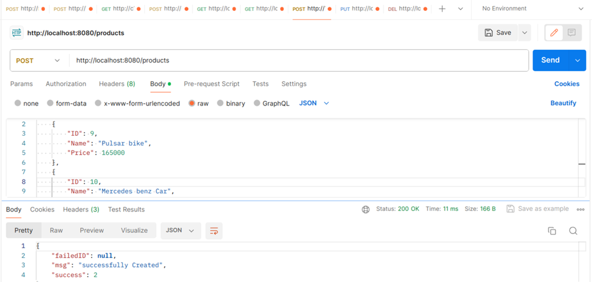
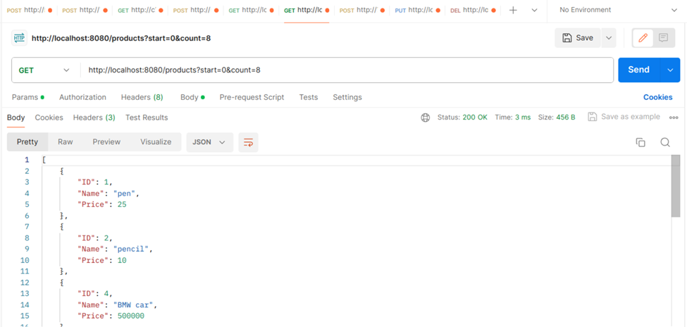
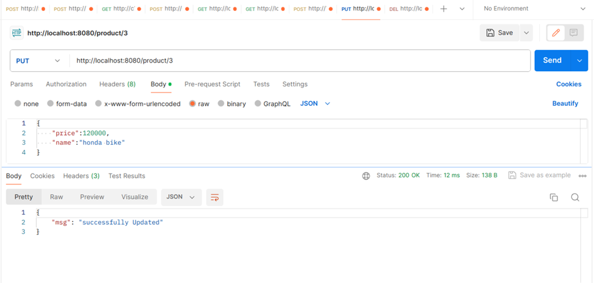
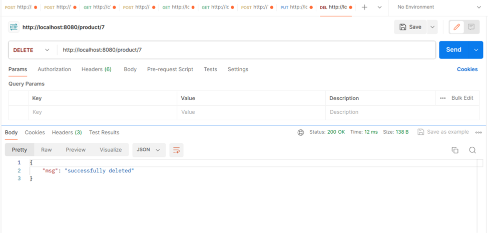

# Simple_inventory
It is simple Backend Rest API Application  that will allow you to Create,Update,Delete,Get operations using Golang & Postgres DB.

Tech Stack - Golang,Gorilla Mux,Postgres DB

About the Project : 

- It is Simple Inventory Application that will demonstrate how the data will be Added,Modified,Deleted and Obtainined  that stored in Postgres DB using Gorilla Mux Package in Golang .I followed the MVC Pattern for designing the structure of the code.

About the File Structure : 

- config.yaml  ---> file contains the Credentials & enviornment for running this application . make sure you provided the databasename,username,password and table name.

- Main  ---> folder contains main.go and app.go files, that is responsible for initiating all kind of configurations that is necesssary to run this application.

- Service --->  folder contains Handler.go file which is responsible for Executing the Business logic for Given end points.

- Persistence  ---> folder contains Db Connections,DB Functions for executing Queries

Go verison - 1.17

Initial steps :

- Make sure you are in the Project Directory and inside main folder.

Command to Build the APP  -  go build .  ( make sure it is creating a build for current directory)

Command to Run the APP   - ./main --env local -- port 8080 ( here env mentions the current env you want to run and port specifies the port number to listen and start the server).

Necessary Details : 
    
- Make sure you installed postgres DB in your machine and provide the port,user name,password,database name and table name in your config.yaml file .    
 

snapshot of the Application with Outputs :

Rest API's End Points :

        Get - /product/{id}

        Post/Create - /products  contains body which have data that should created in Inventory

        Put/Update - /product/{id}  contains body which have data that should be updated in Inventory

        Delete   - /product/{id}  - delete the product from the Inventory 

        Get - /product?start=0&count=3  - Get the products starting from 0 till 3 values

Results ------------------------------

 1) Get Product details of certain ID from Inventory - 

  

 2) Creating a New Product in Inventory -
 
  

 3) Get all the Product Details till Certain count from Inventory -
 
  

 4) Update the Product Details in the Inventory - 
 
 

 5) Delete the Product from the Inventory - 
 
  